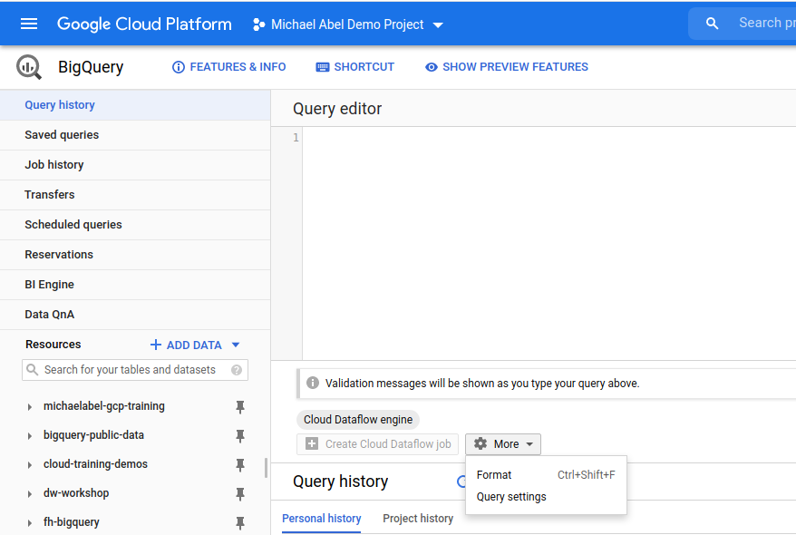
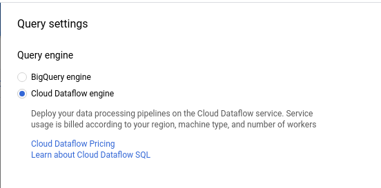
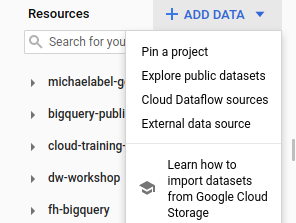
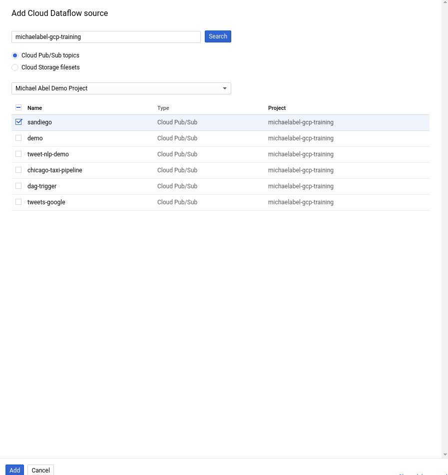
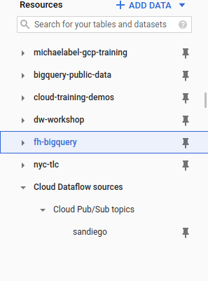
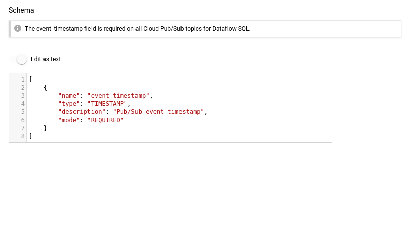
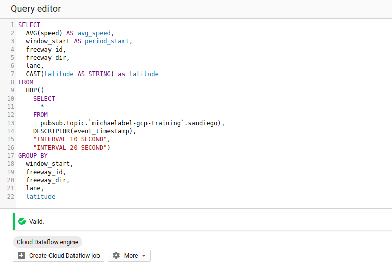
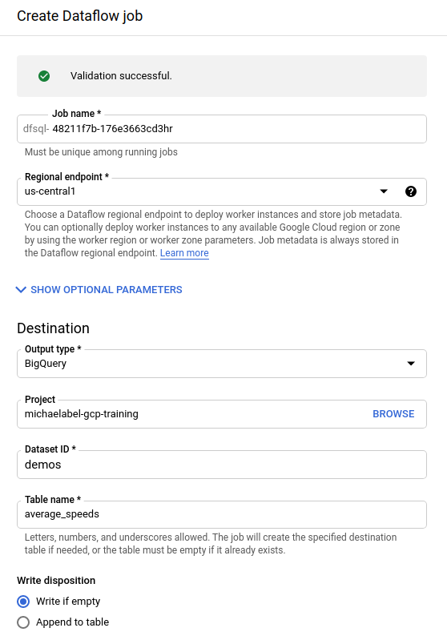

# Dataflow SQL to analyze streaming traffic data

In this demo we will create a Dataflow pipeline to analyze a simulated stream of San Diego traffic data in real time. Instead of creating this pipeline using the Apache Beam Python or Java SDK, we will leverage Dataflow SQL.

Dataflow SQL is a service accessible via the BigQuery console which will parse a SQL statement (in the ZetaSQL dialect) and build a Dataflow pipeline. This is a tool that can ease the use of Dataflow for processing data when custom transformations are not needed in the pipeline.

## Simulated Stream Setup

First we need to set up the simulated stream of traffic data. We will leverage some public traffic data from San Diego and use that to simulate our real-time stream. First we need to download the data we will be streaming.

In Cloud Shell, if you have not already clone the `michaelabel-demos` repo by running the following command

```bash
gcloud source repos clone michaelabel-demos --project=michaelabel-gcp-training
cd michaelabel-demos
git checkout -t origin/main
```

After cloning the repo, we're ready to download the traffic data from a public Cloud Storage location.

```bash
cd ../michaelabel-demos/sandiego_dataflow_sql
bash ./publish/download_data.sh
```

After downloading the data, we just need to set up the stream. The `send_sensor_data.py` Python script will grab batches of data from the file we downloaded and send them to Pub/Sub. The script creates the Pub/Sub topic `sandiego` if it does not already exist in your project.

```bash
export PROJECT_ID=$(gcloud config get-value project)
python ./publish/send_sensor_data.py --speedFactor=60 --project $PROJECT_ID
```
For those who are interested, open up a new Cloud Shell tab and explore the `send_sensor_data.py` script. Note that for Dataflow SQL we expect our messages to have a very specific format:

```json
{k1:v1, k2:v2, ...}
```

Where `k1, k2 ,...,kn` are string-valued keys and `v1, v2,..., vn` are the corresponding values.

Minimize (but do not close!) the Cloud Shell terminal and leave the stream simulator running for now.

## Creating Dataflow Pub/Sub Source and Schema

Next we need to create our Pub/Sub data source for Dataflow SQL and assign a schema to the incoming data. Dataflow will use this schema to assign a Beam schema to our data for processing.

Go to the BigQuery console, and click **More > Query Settings** under the Query Editor. Choose "Cloud Dataflow engine" as the query engine. This will submit our jobs to Dataflow once we are ready





Now we need to create our Pub/Sub source. The topic, sandiego, was created by the `send_sensor_data.py` script we started earlier. So, we just need to point to this topic. Click on **Add Data > Cloud Dataflow sources**.



Select your project and select the `sandiego` topic. Finally click **Add** to add the topic to you pinned list of sources.



We need to supply a schema for the topic so that Dataflow can process the data using a SQL query. To do this go under **Resources** and scroll down to **Cloud Dataflow sources > Cloud Pub/Sub topics > sandiego** and click "Edit Schema".





Once there, click on the **Edit Schema** button and copy paste the following JSON into the box.

```json
[
    {
        "name": "event_timestamp",
        "description": "Pub/Sub event timestamp",
        "mode": "REQUIRED",
        "type": "TIMESTAMP"
    },
    {
        "name": "timestamp",
        "description": "Timestamp of sensor reading",
        "mode": "REQUIRED",
        "type": "STRING"
    },
    {
        "name": "latitude",
        "description": "Latitude for sensor location",
        "mode": "REQUIRED",
        "type": "FLOAT64"
    },
    {
        "name": "longitude",
        "description": "Longitude for sensor location",
        "mode": "REQUIRED",
        "type": "FLOAT64"
    },
    {
        "name": "freeway_id",
        "description": "Freeway number",
        "mode": "REQUIRED",
        "type": "INT64"
    },
    {
        "name": "freeway_dir",
        "description": "Freeway direction",
        "mode": "REQUIRED",
        "type": "STRING"
    },
    {
        "name": "lane",
        "description": "Lane number in freeway",
        "mode": "REQUIRED",
        "type": "INT64"
    },
    {
        "name": "speed",
        "description": "Speed at sensor in MPH",
        "mode": "REQUIRED",
        "type": "FLOAT64"
    }
]
```

Now that we have registered our schema, we're ready to execute our query! Let us point out a few parts of our query.

```sql
FROM
  HOP((
    SELECT
      *
    FROM
      pubsub.topic.`YOUR_PROJECT_ID`.sandiego),
    DESCRIPTOR(event_timestamp),
    "INTERVAL 10 SECOND",
    "INTERVAL 20 SECOND")
```

Note that we are using the `HOP` function to define our sliding windows. We could use `TUMBLE` for fixed windows or `SESSION` for session windows instead. In this case we will be working with windows of length 20 seconds and offset 10 seconds. For this example we will use the Pub/Sub generated `event_timestamp` field, but we could provide our own custom timestamp field here.

Finally what about the syntax for our sources? `pubsub.topic` specifies that our source is a Pub/Sub topic and then we provide the project ID and topic name of the topic we wish to use.

The rest of the SQL query is really straightforward! The full query is below.

```sql
SELECT
  AVG(speed) AS avg_speed,
  window_start AS period_start,
  freeway_id,
  freeway_dir,
  lane,
  CAST(latitude AS STRING) AS latitude
FROM
  HOP((
    SELECT
      *
    FROM
      pubsub.topic.`YOUR_PROJECT_ID`.sandiego),
    DESCRIPTOR(event_timestamp),
    "INTERVAL 10 SECOND",
    "INTERVAL 20 SECOND")
GROUP BY
  window_start,
  freeway_id,
  freeway_dir,
  lane,
  latitude
```

Copy and paste the query about into the query editor. Be sure to replace `YOUR_PROJECT_ID` with your project ID before moving forward.



We're ready to create our Dataflow SQL job! Click on **Create Cloud Dataflow job**. Be sure to select an endpoint close to your data, select the `demos` dataset from earlier, and use the table name `average_speed_dfsql`. Since this table does not exist yet, be sure to select "Write if empty" for the write disposition before scrolling down and hitting **Create**.



It will take around 5 minutes to spin up the pipeline cluster and start processing data. Note that you may want to check that the simulated sensor script is still running and restart if needed.

After a few minutes, you should be able to see results by simply querying the resutls table.

```sql
SELECT * FROM demos.average_speed_dfsql ORDER BY period_start
```
